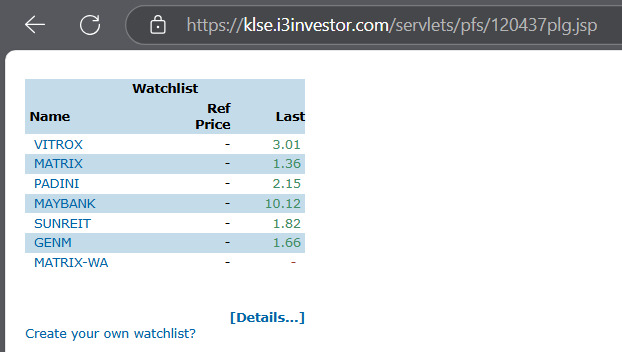
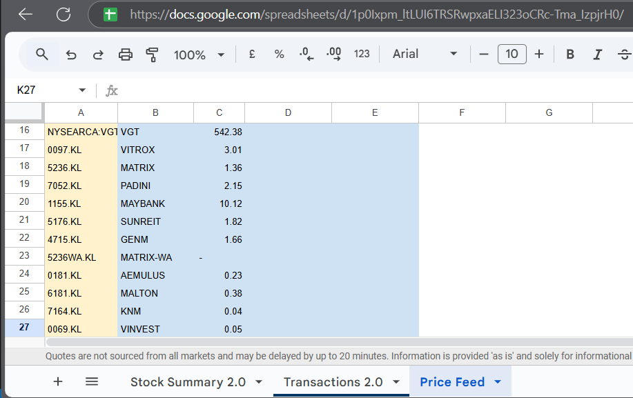

# Stock Price Scraper
Stock Price Scraper is a Python script that scrapes stock prices from public watchlists or portfolios on i3investor to Google Sheet.

## Background
I keep track of my portfolio in a Google Sheet. To fetch stock prices, the straightforward way is to use [GOOGLEFINANCE](https://support.google.com/docs/answer/3093281?hl=en) but unfortunately, it no longer supports most international exchanges. An alternative is to scrape the information through App Script. Whether this works depends on the website's policy which often prevents web scraping.

## How It Works
1. [i3investor](https://klse.i3investor.com/) allows public watchlists or portfolios to be shared as a jsp page.
<figure>
  
  <figcaption style="text-align:center">Example watchlist on i3investor</figcaption>
</figure>

2. It relies on JavaScript to render the content. As such, the HTML returned by `requests.get()` will not include the dynamically generated content. Instead, we use Selenium to render the page.

3. The page displays the portfolio in the form of a `table`. With `BeautifulSoup`, the information is extracted from the `td` tags.

4. Now, what's left is to write the results to the Google Sheet. This is done through the `ezSheets` package (documented [here](https://pypi.org/project/EZSheets/)), an interface to the Google Sheets API that makes common spreadsheet tasks easy to perform.

<figure>
  
  <figcaption style="text-align:center">Example Outcome in Google Sheet</figcaption>
</figure>

## How to Use the Script
1. Open Config.py, edit the variables as necessary. NOte that the script is able to scrape from mutiple price feeds.

2. Follow the steps [here](https://developers.google.com/workspace/drive/api/quickstart/python) to enable the API and download the credentials to the root directory of this project as `credentials-sheets.json`.

## Running Stock Price Scraper in a Virtual Environment
Python virtual environments are isolated spaces that allow you to manage project-specific dependencies without affecting your system's global Python installation. To do so, follow the steps below.

### Setting up Virtual Environment
1. [Install Python](https://www.python.org/downloads/)
2. Double click on `setup.bat`. Wait for the setup to complete.

```bash
Creating virtual environment...
Activating virtual environment...
Installing required packages...
Collecting attrs==25.3.0 (from -r ./requirements.txt (line 1))
  Using cached attrs-25.3.0-py3-none-any.whl.metadata (10 kB)
Collecting beautifulsoup4==4.13.3 (from -r ./requirements.txt (line 2))
  Using cached beautifulsoup4-4.13.3-py3-none-any.whl.metadata (3.8 kB)
...Trimmed...
Done!
Press any key to continue . . .
```

## Running Stock Price Scraper
Double click on `run.bat`. Wait for the script to finish running.
```bash
Activating virtual environment...
Running script...
Opening webdriver...
...Trimmed...
Getting price feed from: https://klse.i3investor.com/servlets/pfs/120437plg.jsp
('VITROX', '3.01')
('MATRIX', '1.36')
('PADINI', '2.15')
('MAYBANK', '10.12')
('SUNREIT', '1.82')
('GENM', '1.66')
...Trimmed...
Price feed retrieved successfully.
Updating spreadsheet...
Spreadsheet updated successfully.
Done!
Press any key to continue . . .
```